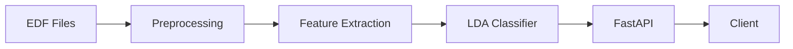

# Phase 1: Recruiter-Ready (48 hours)

**Objective**: Maximize visual impact, prove engineering fundamentals

### 1.1 README Rewrite ⏱️ 2h | Complexity: S

**Files to modify**:
- `README.md` (complete rewrite)

**Acceptance Criteria**:
- [ ] Opens with 60-second quickstart (3 commands max)
- [ ] Includes architecture diagram (ASCII or image)
- [ ] Shows example output with metrics
- [ ] Data section explains how to get Sleep-EDF without confusion
- [ ] Has badges: CI status, coverage, license
- [ ] Docker quickstart before manual setup
- [ ] "Why this matters" section (BCI context)
- [ ] Links to API docs at /docs

**Implementation**:
```bash
# Add mermaid diagram to README
# Add example curl commands with responses
# Add screenshot of FastAPI /docs
```

**Deliverable**: See `README_NEW.md` template

---

### 1.2 GitHub Actions CI ⏱️ 2h | Complexity: S

**Files to create**:
- `.github/workflows/ci.yml`
- `.github/workflows/docker.yml`

**Acceptance Criteria**:
- [ ] Runs on push/PR to master
- [ ] Linting (ruff or flake8)
- [ ] Type checking (mypy)
- [ ] Tests with coverage report
- [ ] Docker build test
- [ ] Coverage badge in README
- [ ] Fails if coverage <80%

**Implementation**:
```yaml
# .github/workflows/ci.yml
name: CI
on: [push, pull_request]
jobs:
  test:
    runs-on: ubuntu-latest
    steps:
      - uses: actions/checkout@v3
      - uses: actions/setup-python@v4
        with:
          python-version: '3.11'
      - run: pip install -e .[dev]
      - run: pytest --cov=sleep_bci --cov-report=xml
      - uses: codecov/codecov-action@v3
```

**Dependencies**: Add to pyproject.toml:
```toml
[project.optional-dependencies]
dev = ["pytest>=7.0", "pytest-cov", "pytest-asyncio", "httpx", "ruff", "mypy"]
```

---

### 1.3 Core Tests ⏱️ 4h | Complexity: M

**Files to create**:
- `tests/conftest.py` (fixtures)
- `tests/test_preprocessing.py`
- `tests/test_api_preprocess.py`
- `tests/test_api_train.py`
- `tests/test_model.py`

**Acceptance Criteria**:
- [ ] Coverage >80% (focus on core logic)
- [ ] All tests pass in CI
- [ ] Uses fixtures for test data
- [ ] API tests use TestClient (httpx)
- [ ] Mocked file I/O for speed

**Key Tests**:
```python
# tests/conftest.py
@pytest.fixture
def mock_edf_pair(tmp_path):
    # Generate minimal synthetic EDF files
    ...

# tests/test_preprocessing.py
def test_discover_pairs_success(tmp_path):
    # Test pair discovery logic
    ...

def test_preprocess_single_night(mock_edf_pair):
    # Test preprocessing without real data
    ...

# tests/test_api_preprocess.py
@pytest.mark.asyncio
async def test_preprocess_dry_run():
    async with AsyncClient(app=app, base_url="http://test") as ac:
        response = await ac.post("/v1/preprocess", json={...})
    assert response.status_code == 200
```

**Priority**: API tests > preprocessing > model

---

### 1.4 Architecture Diagram ⏱️ 1h | Complexity: S

**Files to create**:
- `docs/architecture.svg` (or use mermaid in README)
- `docs/data-flow.md`

**Acceptance Criteria**:
- [ ] Shows: Data → Preprocess → Features → Model → API
- [ ] Includes: Docker, FastAPI, background tasks
- [ ] Shows API endpoints visually
- [ ] Embedded in README.md

**Tool**: Use mermaid.js (renders in GitHub)


---

### 1.5 Example Output ⏱️ 1h | Complexity: S

**Files to create**:
- `docs/example-output.md`
- `models/example-confusion-matrix.png`

**Acceptance Criteria**:
- [ ] Shows preprocessing output
- [ ] Shows training metrics (pretty-printed)
- [ ] Shows API response examples
- [ ] Confusion matrix visualization
- [ ] Links from README

**Implementation**:
```python
# scripts/generate_confusion_matrix.py
import matplotlib.pyplot as plt
import seaborn as sns
# Load results.json, plot confusion matrix, save PNG
```
